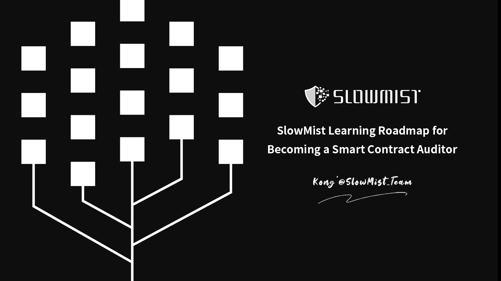
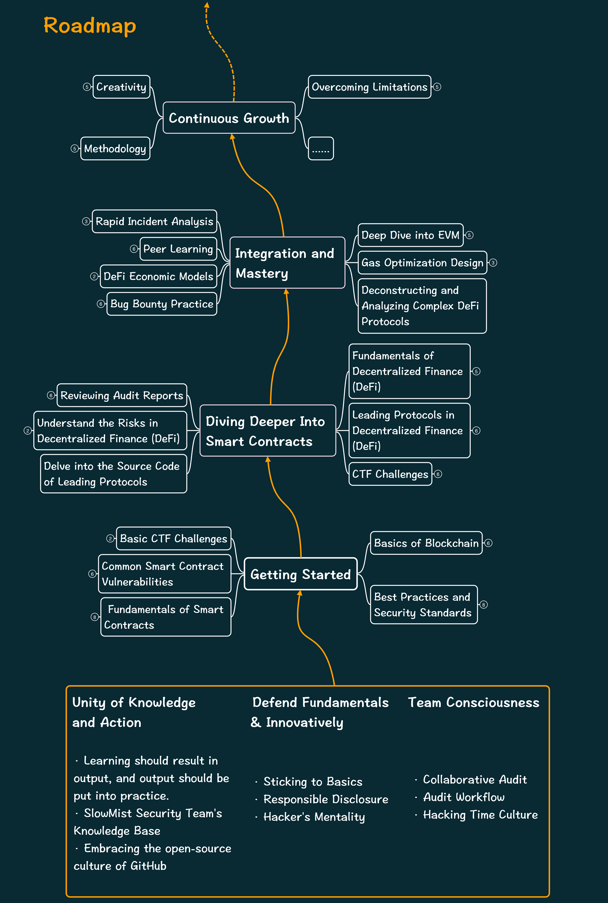
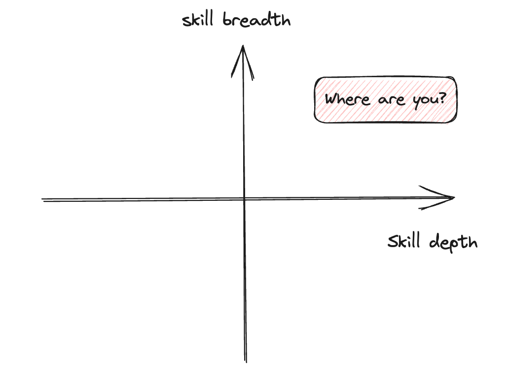

By: [Kong'](https://twitter.com/TycheKong)@SlowMist Security Team

中文版：**[慢雾(SlowMist)智能合约审计技能树](README_CN.md)**

⚓️**Contents**

- [**Introduction**](#introduction)
- [**Roadmap**](#roadmap)
- [**Preparation Required**](#preparation-required)
  - [**1. Unity of Knowledge and Action**](#1-unity-of-knowledge-and-action)
  - [**2. Defend Fundamentals \& Innovatively**](#2-defend-fundamentals--innovatively)
  - [**3. Team Consciousness**](#3-team-consciousness)
- [**Getting Started**](#getting-started)
  - [**1. Basics of Blockchain**](#1-basics-of-blockchain)
  - [**2. Fundamentals of Smart Contracts**](#2-fundamentals-of-smart-contracts)
  - [**3. Common Smart Contract Vulnerabilities**](#3-common-smart-contract-vulnerabilities)
  - [**4. Best Practices and Security Standards**](#4-best-practices-and-security-standards)
  - [**5. Basic CTF Challenges**](#5-basic-ctf-challenges)
- [**Diving Deeper Into Smart Contracts**](#diving-deeper-into-smart-contracts)
  - [**1. Fundamentals of Decentralized Finance (DeFi)**](#1-fundamentals-of-decentralized-finance-defi)
  - [**2. Leading Protocols in Decentralized Finance (DeFi)**](#2-leading-protocols-in-decentralized-finance-defi)
  - [**3. Delve into the Source Code of Leading Protocols**](#3-delve-into-the-source-code-of-leading-protocols)
  - [**4. Understand the Risks in Decentralized Finance (DeFi)**](#4-understand-the-risks-in-decentralized-finance-defi)
  - [**5. Reviewing Audit Reports**](#5-reviewing-audit-reports)
  - [**6. CTF Challenges**](#6-ctf-challenges)
- [**Integration and Mastery**](#integration-and-mastery)
  - [**1. Deep Dive into EVM**](#1-deep-dive-into-evm)
  - [**2. Gas Optimization Design**](#2-gas-optimization-design)
  - [**3. DeFi Economic Models**](#3-defi-economic-models)
  - [**4. Deconstructing and Analyzing Complex DeFi Protocols**](#4-deconstructing-and-analyzing-complex-defi-protocols)
  - [**5. Peer Learning**](#5-peer-learning)
  - [**6. Rapid Incident Analysis**](#6-rapid-incident-analysis)
  - [**7. Bug Bounty Practice**](#7-bug-bounty-practice)
- [**Continuous Growth**](#continuous-growth)
  - [**1. Overcoming Limitations**](#1-overcoming-limitations)
  - [**2. Methodology**](#2-methodology)
  - [**3. Creativity**](#3-creativity)
- [**Acknowledgments**](#acknowledgments)

## **Introduction**

This skill chart is a compilation of the abilities required for SlowMist's security team's smart contract security auditors. It aims to enumerate the essential skills needed for smart contract security audits and inspire team members to adopt a mindset of research, innovation, and engineering evolution.

Smart contract security auditing skills are primarily divided into four parts: Finding the Entrance, Singing by the Door, Integrative Mastery, and Breaking Through. These stages progressively outline the expertise needed at each level. However, before diving into these, it's crucial to equip our minds with some foundational skills, which will serve as our anchor point in the audit journey.

## **Roadmap**

## **Preparation Required**

As Abraham Lincoln once said: “Give me six hours to chop down a tree and I will spend the first four sharpening the axe.” This same approach can be applied to smart contract auditing. Strengthening our mindset before starting is essential, allowing us to move with conviction and travel further.

### **1. Unity of Knowledge and Action**

Cognition and execution go hand in hand. Theoretical knowledge and its practical application should align seamlessly.

- Learning should result in output, and output should be put into practice.
- [SlowMist Security Team's Knowledge Base](https://github.com/slowmist/Knowledge-Base)
- Embracing the open-source culture of GitHub

### **2. Defend Fundamentals & Innovatively**

Ethics and the law are the foundational principles for security professionals. While staunchly adhering to these principles, security professionals must also forge strong technical skills, surprising adversaries when least expected.

- Sticking to the Basics:
  - Auditors should abide by the law and uphold ethical standards
- Responsible Disclosure:
  - SlowMist's alert procedure
  - [FIRST's code of ethics](https://www.first.org/global/sigs/ethics/ethics-first)
- Hacker’s Mentality:
  - While adhering to principles, prevail with unexpected strategies
  - Defend Fundamentals: Approach with reverence and always adhere to basic
  - Innovative: Think outside the box, be meticulous, employ reverse and open-minded thinking

### **3. Team Consciousness**

The capabilities of an individual are always limited, but teamwork can effectively compensate for personal shortcomings.

- Collaborative Audit Flow:
  - Collaborative auditing on the SlowMist MistPunk workbench ensures audit quality through technical means and accumulates auditing experience
- Audit Workflow:
  - SlowMist's audit workflow ensures audit quality through managerial practices, serving to identify and fill in any gaps in the audit process
- Hacking Time Culture:
  - Team members are encouraged to engage in spontaneous intellectual exchanges and sharing, aligning team capabilities through these collaborative interactions and thereby elevating the overall team proficiency

## **Getting Started**

The development of the cryptographic world to date encompasses disciplines such as cryptography, economics, and data science. Faced with the immense volume of knowledge in the cryptographic world, determining a point of entry is crucial. In this phase, we will start by exploring Ethereum and its smart contract language, Solidity, as a gateway into the world of cryptocurrency.

### **1. Basics of Blockchain**

Before understanding what smart contracts are, one should first comprehend the blockchain platform on which they operate.

- [What is a blockchain?](https://www.investopedia.com/terms/b/blockchain.asp)
- [Visual demonstration of blockchain](https://www.youtube.com/watch?v=_160oMzblY8)
- [How cryptocurrencies work](https://www.youtube.com/watch?v=bBC-nXj3Ng4)
- Reading "[Mastering Bitcoin](https://github.com/bitcoinbook/bitcoinbook)"
- Reading "[Mastering Ethereum](https://github.com/ethereumbook/ethereumbook)"
  - Emphasis should be on Chapters 1, 4, 5, 6, 7, 13, and 15

### **2. Fundamentals of Smart Contracts**

Different blockchains might employ various languages to develop smart contracts, such as Solidity, Move, Rust, Vyper, Cairo, C++, etc. Currently, Solidity remains the most popular and beginner-friendly smart contract language for EVM-compatible chains. It's essential to thoroughly read its language documentation. Moreover, one should understand the design standards of token contracts running on Ethereum and their specific contract implementations. Building on this foundation, it's crucial to understand how smart contracts can be made upgradable and to practically master the writing and testing of smart contracts.

Resources and Tools for Mastering Smart Contracts with Solidity

- [Solidity Official Documentation](https://docs.soliditylang.org/en/latest/)

- Essential Reading "[Mastering Ethereum](https://github.com/ethereumbook/ethereumbook)"
  - Emphasis on reading the remaining chapters
  
- Understanding Ethereum's Standard Proposals ([ERC](https://eips.ethereum.org/erc))
  - [ERC20](https://eips.ethereum.org/EIPS/eip-20): Standard for fungible tokens
  - [ERC165](https://eips.ethereum.org/EIPS/eip-165): Interface standard
  - [ERC173](https://eips.ethereum.org/EIPS/eip-173): Contract ownership standard
  - [ERC191](https://eips.ethereum.org/EIPS/eip-191): Data signature standard
  - [ERC601](https://eips.ethereum.org/EIPS/eip-601): Deterministic wallet hierarchical structure standard
  - [ERC721](https://eips.ethereum.org/EIPS/eip-721): Non-fungible token standard
  - [ERC777](https://eips.ethereum.org/EIPS/eip-777): Interoperable token standard
  - [ERC1155](https://eips.ethereum.org/EIPS/eip-1155): Multi-token standard
  - [ERC1167](https://eips.ethereum.org/EIPS/eip-1167): Minimal proxy contract
  - [ERC1967](https://eips.ethereum.org/EIPS/eip-1967): Proxy data storage slots
  - [ERC2612](https://eips.ethereum.org/EIPS/eip-2612): Token permit signature
  - [ERC4626](https://eips.ethereum.org/EIPS/eip-4626): Token vault standard
  
- Studying OpenZeppelin's [token](https://github.com/OpenZeppelin/openzeppelin-contracts/tree/master/contracts/token) implementations

- Understanding what upgradable contracts/proxy contracts ar
  
  * [Introduction to different proxy contract patterns](https://ethereum-blockchain-developer.com/110-upgrade-smart-contracts/00-project/)
  * [Proxies Deep Dive](https://proxies.yacademy.dev/pages/proxies-list/)
  * [OpenZeppelin Proxy](https://docs.openzeppelin.com/contracts/4.x/api/proxy) implementation documentation
  
- Learning to Write Smart Contracts
  - [WTF Solidity Smart Contract Tutorials](https://www.wtf.academy/en/)
  - [Crypto Zombies](https://cryptozombies.io/en/course/)
  - [Smart Contract Engineer](https://www.smartcontract.engineer/)
  - [Solidity by Example](https://solidity-by-example.org/)

- Utilizing Smart Contract Build Tools
  - Popular Online IDEs
    - [Remix](https://remix.ethereum.org/)
    - [ChainIDE](https://chainide.com/)
    - [Tenderly Sandbox](https://sandbox.tenderly.co/)
    
  - Familiarization with Package Managers
    - [npm](https://www.npmjs.com/)
    - [yarn](https://yarnpkg.com/)
    - [pnpm](https://pnpm.io/)
    
  - Popular Smart Contract Testing and Debugging Frameworks
    - [Foundry](https://book.getfoundry.sh/)
      * Convenient [testing](https://book.getfoundry.sh/forge/tests) tools
      * [Cheatcodes](https://book.getfoundry.sh/cheatcodes/)
      * [Best practices](https://book.getfoundry.sh/tutorials/best-practices)
    
    * [Hardhat](https://hardhat.org/hardhat-runner/docs/getting-started#overview)
      * Leveraging its potent [plugins](https://hardhat.org/hardhat-runner/plugins)
    
    * [Brownie](https://eth-brownie.readthedocs.io/en/stable/)
    * [Tenderly](https://tenderly.co/)
      * [Convenient DevNet development testing environment](https://docs.tenderly.co/devnets/intro-to-devnets)
      * [Quick transaction simulations](https://docs.tenderly.co/simulations-and-forks/intro-to-simulations)
      * [Visual transaction debugging tools](https://docs.tenderly.co/debugger/how-to-use-tenderly-debugger)
  
  * Interacting with Smart Contracts
    * Understanding [JSON-RPC](https://ethereum.org/en/developers/docs/apis/json-rpc/)
    * [ethers.js](https://docs.ethers.org/)
    * [Web3.js](https://web3js.readthedocs.io/)
    * [Web3.py](https://web3py.readthedocs.io/)
    * [viem](https://viem.sh/)

### **3. Common Smart Contract Vulnerabilities**

After mastering the fundamentals of smart contracts, it's essential to understand common vulnerabilities and the principles behind these vulnerabilities. Quillhash's vulnerability list, which aggregates multiple sources, offers a comprehensive view of the prevalent types of smart contract vulnerabilities. (For beginners, it's recommended to read through all the lists repeatedly to reinforce their understanding.)

- [DASP Top 10](https://www.dasp.co/)
- [SWC Smart Contract Weakness Classification](https://swcregistry.io/)
- [Smart Contract Security Guide](https://scsfg.io/hackers/)
- Kaden: [Smart Contract Attack Vectors](https://github.com/kadenzipfel/smart-contract-vulnerabilities) 
- Quillhash: [Solidity Attack Vectors](https://github.com/Quillhash/Solidity-Attack-Vectors)
- [RareSkills Smart Contract Security](https://www.rareskills.io/post/smart-contract-security)

### **4. Best Practices and Security Standards**

As auditors, it's crucial to be familiar with the best practices and security standards of smart contracts. Best practices serve as a reference in identifying security issues during an audit, while security standards provide a basis for any security issues raised.

- [Solidity Patterns](https://fravoll.github.io/solidity-patterns/)
- [Solcurity](https://github.com/transmissions11/solcurity)
- [ConsenSys Smart Contract Best Practices](https://github.com/Consensys/smart-contract-best-practices/blob/master/README.md) 
- [Solidity Security Pitfalls and Best Practices 101](https://secureum.substack.com/p/security-pitfalls-and-best-practices-101)
- [Solidity Security Pitfalls and Best Practices 201](https://secureum.substack.com/p/security-pitfalls-and-best-practices-201)
- [SCSVSv2](https://github.com/securing/SCSVS/tree/prerelease/SCSVSv2)
- [EEA EthTrust Certification](https://entethalliance.org/specs/ethtrust-sl/)
- [Foundry Testing Best Practices](https://book.getfoundry.sh/tutorials/best-practices)

### **5. Basic CTF Challenges**

After acquiring foundational knowledge about blockchain, smart contracts, and common vulnerabilities, it's beneficial to consolidate and apply this knowledge through basic Capture The Flag (CTF) challenges.

- [OpenZeppelin Ethernaut](https://ethernaut.openzeppelin.com/)
- [Capture the Ether](https://capturetheether.com/)

## **Diving Deeper Into Smart Contracts**

Having grasped the basics of blockchain and smart contracts, we've essentially opened the door to Solidity smart contract security auditing. Beyond this door, the world of smart contracts is still vast. In this stage, we'll delve deeper into the expansive realm of smart contract applications, starting with decentralized finance (DeFi).

### **1. Fundamentals of Decentralized Finance (DeFi)**

Blockchain and smart contracts have made the construction of DeFi possible, and the emergence of DeFi has spurred the rapid development of blockchains like Ethereum. Before delving further, one should understand: What is DeFi?

- Read "[How To DeFi: Beginner](https://landing.coingecko.com/how-to-defi/)"
- Read "[How To DeFi: Advanced](https://landing.coingecko.com/how-to-defi/)"
- [Introduction to different types of DeFi](https://teachyourselfcrypto.com/#ftoc-module-4-decentralized-finance-defi)
  - Understand what each type of DeFi is
  - Grasp basic economic knowledge and common terminologies
- [Introduction to fundamental financial strategies](https://www.khanacademy.org/economics-finance-domain/core-finance/derivative-securities)
- [Economics Model 101](https://tokenomicsdao.xyz/tokenomics101/)

### **2. Leading Protocols in Decentralized Finance (DeFi)**

After an initial understanding of what DeFi is, it's important to delve deeper into what these platforms have achieved and how they achieved it. This can be accomplished by reviewing the technical documentation of the current leading DeFi protocols to gain preliminary insights into their implementations.

- [MakerDAO](https://docs.makerdao.com/) (Collateralized Debt Position) 
- [AAVE](https://docs.aave.com/hub/) (Lending)
  - [V2](https://docs.aave.com/developers/v/2.0/)
  - [V3](https://docs.aave.com/developers/getting-started/readme)
- Compound (Lending)
  - [V2](https://docs.compound.finance/v2/)
  - [V3](https://docs.compound.finance/)
- Uniswap (Decentralized Exchange)
  - [V2](https://docs.uniswap.org/contracts/v2/overview)
  - [V3](https://docs.uniswap.org/contracts/v3/overview)
- Curve (Decentralized Exchange)
  - [Technical Documentation](https://docs.curve.fi/)
  - [Algorithm Overview](https://hackmd.io/@alltold/curve-magic)
  - Detailed Explanation of Curve's [Newton Iteration](https://0xreviews.xyz/posts/2022-02-28-curve-newton-method)
- Chainlink (Oracle)
  - [Price Oracles](https://docs.chain.link/data-feeds)
  - [VRF](https://docs.chain.link/vrf/v2/introduction) (Verifiable Random Function)
- Convex Finance (Yield Optimization)
  - Protocol [Overview](https://docs.convexfinance.com/convexfinance/)
  - [Technical Documentation](https://docs.convexfinance.com/convexfinanceintegration/)
- [Yearn Finance](https://docs.yearn.fi/getting-started/intro) (Yield Aggregator)
- [GMX](https://gmxio.gitbook.io/gmx/) (Derivatives)
- [Nexus Mutual](https://docs.nexusmutual.io/overview/) (Insurance)
- [OpenSea](https://github.com/ProjectOpenSea/seaport#seaport) (NFT Marketplace)
- [Set Protocol](https://docs.tokensets.com/) (Index Funds)
- [Lido](https://docs.lido.fi/) (Liquid Staking)
- ... and more

### **3. Delve into the Source Code of Leading Protocols**

Many DeFi projects currently interrelate and combine, with some leading DeFi protocols forming the cornerstone of complex DeFi combinations. Hence, mastering the implementation of these DeFi initiatives is critical. After an initial understanding of DeFi's workings through protocol documentation, further comprehension can be achieved by studying the complete source code to grasp specific logic and economic models.

### **4. Understand the Risks in Decentralized Finance (DeFi)**

DeFi isn't solely about smart contracts; the frontend and backend are vital components. Most users interact with DeFi through the frontend. Therefore, after understanding DeFi's operations and implementations, it's essential to learn and practice its risks through frontend security measures, backend security configuration requirements, and historical vulnerabilities in the DeFi sector.

- Understanding Web Frontend Security
  - Read the "SlowMist Web Frontend Security Best Practices Guide"
  - Dive deeper into "Web Frontend Hacker Techniques Revealed"
- Understanding DeFi Hacks
  - [SlowMist DeFi Hack Analysis](https://docs.google.com/document/d/1b-uHJ7XDe1-xyaQQ9MYB3FGmYD7K_ULH8bUc20EZfu8/edit)
  - [SlowMist Medium Articles](https://slowmist.medium.com/)
  - [DeFiHackLabs](https://web3sec.notion.site/web3sec/Web3-Security-ddaa8bf9a985494dbaf70d698345b899)
  - [Rekt](https://rekt.news/zh/)
  - [Immunefi](https://medium.com/@immunefi)
  - [QuillAudits](https://quillaudits.medium.com/)
  - [BlockSec](https://blocksecteam.medium.com/)
  - [Neptune Mutual](https://medium.com/@neptunemutual)
  - [PeckShield](https://twitter.com/peckshield)
  - [hacxyk](https://medium.com/@hacxyk)
  - [TrailOfBits](https://blog.trailofbits.com/)
  - [Secureum](https://secureum.substack.com/)
  - [Openzeppelin](https://blog.openzeppelin.com/security-audits/)
  - [OfferCIA](https://officercia.mirror.xyz/)

### **5. Reviewing Audit Reports**

During an audit, an individual's perspective may miss certain aspects and cannot cover all scenarios. Therefore, reading other people's audit reports is crucial to learn different methods of vulnerability discovery and various auditing thought processes.

- [SlowMist Audit Reports](https://github.com/slowmist/Knowledge-Base)
- [Solodit Aggregation](https://solodit.xyz/)
- [Code4rena Audit Reports](https://code4rena.com/reports)
- [Consensys Audit Reports](https://consensys.net/diligence/audits/)
- [QuillAudits Audit Reports](https://github.com/Quillhash/QuillAudit_Reports)
- [Spearbit Audit Reports](https://github.com/spearbit/portfolio/tree/master/pdfs)
- [Sherlock Audit Reports](https://github.com/sherlock-protocol/sherlock-reports)
- [ADBK Audit Reports](https://github.com/abdk-consulting/audits)
- [BlockSec Audit Reports](https://github.com/blocksecteam/audit-reports)
- [Certik Audit Reports](https://www.certik.com)
- [ChainSecurity Audit Reports](https://chainsecurity.com/smart-contract-audit-reports/)
- [Cyfrin Audit Reports](https://github.com/Cyfrin/cyfrin-audit-reports)
- [PeckShield Audit Reports](https://github.com/peckshield/publications)
- [OpenZeppelin Audit Reports](https://blog.openzeppelin.com/tag/security-audits)
- [Complete List of Security Audit Reports](https://github.com/0xNazgul/Blockchain-Security-Audit-List)

### **6. CTF Challenges**

Engage in more advanced CTF challenges to test new skills and grow

- [EtherHack](https://etherhack.positive.com/)
- [SI Blockchain CTF](https://blockchain-ctf.securityinnovation.com/)
- [QuillCTF](https://www.quillaudits.com/academy/ctf)
- [Curta CTF](https://www.curta.wtf/)
- [Paradigm CTF](https://ctf.paradigm.xyz/)
- [Cipher Shastra CTF](https://ciphershastra.com/index.html)
- [Damn Vulnerable DeFi](https://www.damnvulnerabledefi.xyz/)
- [unhackedctf](https://github.com/unhackedctf)

## **Integration and Mastery**

Through the exploration of leading DeFi platforms, a profound understanding of DeFi will be established. Moving forward, by learning from the foundational layer of EVM to the upper economic models of DeFi, we can continue to deepen our grasp on smart contracts. During this process, independently auditing complex smart contracts can help solidify one's own audit methodology.

### **1. Deep Dive into EVM**

The EVM (Ethereum Virtual Machine) is responsible for executing smart contract instructions. A comprehensive understanding of the EVM aids in a more in-depth grasp of the deployment, invocation, execution, and data storage of smart contracts. This foundational knowledge is also pivotal for Gas optimization and discovering vulnerabilities.

- [About EVM](https://www.evm.codes/about)
- Noxx's [In-depth Research on EVM](https://noxx.substack.com/p/evm-deep-dives-the-path-to-shadowy) 
- [Parsing Solidity Slot Data](https://ethdebug.github.io/solidity-data-representation/) 
- [Ethereum Yellow Paper](https://ethereum.github.io/yellowpaper/paper.pdf)
  - [Simplified Version](https://github.com/chronaeon/beigepaper) 
- [EVM Implementation Examples](https://github.com/noxx3xxon/evm-by-example) 

### **2. Gas Optimization Design**

All on-chain transactions incur Gas costs. For complex contracts, optimizing Gas can reduce user interaction costs, thereby attracting more users. This demands that auditors have a certain understanding of Gas optimization design.

- [Gas Optimization References 1](https://www.alchemy.com/overviews/solidity-gas-optimization)
- [Gas Optimization References 2](https://www.alchemy.com/overviews/solidity-gas-optimization)
- [Gas Optimization References 3](https://coinsbench.com/structs-in-solidity-best-practices-for-gas-efficiency-by-0xlazard-4e984a7485cf)

### **3. DeFi Economic Models**

The economic model is a core component of DeFi products, so it's essential to understand the risks associated with these models. Throughout the learning process, one should develop and consolidate their perspectives and methodologies.

- [Governance Risks](https://arxiv.org/abs/2308.04267)
- [Summary of Risks in DeFi Economic Models](https://github.com/engn33r/DeFi-Risk-Modelling-Awesome) 
  - [Euler Oracle Manipulation Tool](https://oracle.euler.finance/)
  - [Chaos Lab Uniswap v3 Oracle Manipulation Risk](https://community.chaoslabs.xyz/uniswap/twap)
  - [Agent Buttercup simulation engine](https://github.com/Cozy-Finance/agent-buttercup)
  - [Curve simulation tool](https://github.com/curveresearch/curvesim)
  - [DELV agent-based simulation tool](https://github.com/delvtech/elf-simulations)
  - Uniswap v3 simulator[ option 1](https://github.com/Bella-DeFinTech/uniswap-v3-simulator),[ option 2](https://github.com/aloelabs/uniswap-simulator),[ option 3](https://github.com/DefiLab-xyz/uniswap-v3-simulator)

### **4. Deconstructing and Analyzing Complex DeFi Protocols**

After mastering these skills, auditors should be capable of dissecting and analyzing complex, highly innovative DeFi protocols.

- To be released...

### **5. Peer Learning**

Learning from other outstanding peers who are researching various topics can provide us with more insights and broaden our horizons.

- [Bytes032](https://blog.bytes032.xyz/)
- [Noxx](https://noxx.substack.com/)
- [Mixbytes](https://mixbytes.io/blog/)
- [Samczsun](https://samczsun.com/research/)
- [Cmichel](https://cmichel.io/)
- [Pessimistic](https://blog.pessimistic.io/)
- [OfficerCia](https://officercia.mirror.xyz/)
- [Smart Contract Research Forum](https://www.smartcontractresearch.org/)
- [Zefram](https://zefram.xyz/posts/)
- [Alin Tomescu](https://alinush.github.io/)
- [Christoph Michel](https://cmichel.io/)
- [Kyrian Alex](https://kyrianalex.substack.com/)
- And more

### **6. Rapid Incident Analysis**

After independently auditing numerous complex projects, accumulating extensive knowledge, and experiencing various business scenarios, auditors should be able to respond quickly to unforeseen security incidents and conduct rapid analysis and reporting. Here are some commonly used analysis tools:

- Contract Decompilation Tools
  - [Dedaub](https://library.dedaub.com/decompile)
    - [Panoramix](https://github.com/palkeo/panoramix)
    - [abi-decompiler](https://github.com/Decurity/abi-decompiler)
    - [heimdall-rs](https://github.com/Jon-Becker/heimdall-rs)
    - [ethervm](https://ethervm.io/decompile)
    - [Pyevmasm](https://github.com/crytic/pyevmasm)
- Transaction Analysis Tools
  - [Phalcon](https://explorer.phalcon.xyz/)
    - [ethtx.info](https://ethtx.info/)
    - [Tx eth samczsun](https://tx.eth.samczsun.com/)
    - [Tenderly](https://tenderly.co/)
    - [Eigenphi](https://eigenphi.io/)
    - [SocketScan](https://socketscan.io/)
- Others
  - [Web3 Security Tools](https://github.com/Quillhash/Web3-Security-Tools)
    - [On Chain Investigations Tools List](https://github.com/OffcierCia/On-Chain-Investigations-Tools-List)

### **7. Bug Bounty Practice**

Engaging in real-world scenarios is the best way to test your skills.

- [Immunefi](https://immunefi.com)
- [BugRap](https://bugrap.io)
- [Code4rena](https://code4rena.com)
- [HackerOne](https://hackerone.com)
- [HackenProof](https://hackenproof.com)
- [HatsFinance](https://hats.finance/)
- And more 

## **Continuous Growth**

After entering the world of Solidity smart contracts, one should not be content with circling within a single domain. Instead, you should crystallize your own methodology, boldly carve out a new path, break through, and expand into other areas while deepening your expertise in the current field.

### **1. Overcoming Limitations**

- Don't confine yourself to Solidity; explore other smart contract languages like Rust, Vyper, Cairo, and Move
- Don't limit yourself to smart contracts; understand popular public blockchains like BTC, Cosmos, Solana, Starknet, EVM L2, and more
- Beyond blockchain, gain insights into areas like Web2.0 and mobile development
- Dive deeper into the field of cryptography
- And more

### **2. Methodology**

After mastering the skills of smart contract security auditing, you can develop your own methodology. This helps you quickly identify the core issues and determine problem-solving approaches. A good methodology can greatly increase your efficiency.

- Methodology for auditing work
- Methodology for smart contract security practices
- Approaches to problem-solving
- Building a thinking framework

### **3. Creativity**

Creativity is the weapon that allows us to conquer challenges and the essential attribute for progress. After acquiring skills systematically, nurture your creativity to advance further.

- Cultivate curiosity
  - Learn new things
  - Don't limit yourself to your circle, profession, or field
- Pursue knowledge relentlessly
  - Approach knowledge with reverence
  - Explore new realms of knowledge
- Embrace the hacker mindset
  - Staying true to principles while thinking outside the box
- Be adept at research
  - Aim for practical results and publish research
- Implement engineering principles
  - Turn ideas and research into practical solutions and test them in real-world
    - SlowMist MistEye Monitoring System
    - SlowMist Contract Visibility Analysis Tool
    - SlowMist Static Vulnerability Scanner
    - And more

## **Acknowledgments**

Special thanks to friends who provided valuable feedback:

- [Cos](https://twitter.com/evilcos)
- [23pds](https://twitter.com/IM_23pds)
- [T41nk](https://twitter.com/T41nk_)
- Doublenine
- Flush
- Blue
- Lizi

Thanks to Jian for the English translation and to Hik3 for designing the cover image.